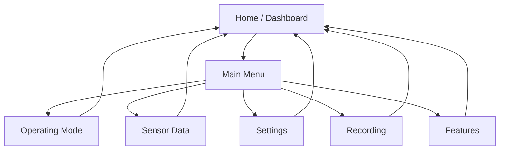

# HMI Specification — Golf Cart Display

> **Status:** Design / Specification
> **Hardware:** 3.5" ILI9488 SPI TFT (480×320), no touch
> **Input:** Joystick (short/double/long press) + dedicated safety arm switch
> **Node:** `hmi_node` (Python, non-critical)

This document is the authoritative specification for the golf cart's operator
display. It defines the screen layout, navigation model, data sources, and
interaction rules. Mockups are provided as SVGs in [`docs/hmi/`](hmi/).

---

## 1. Design Principles

1. **Safety first.** The HMI is *informational and request-only*. It can never
   bypass the Safety Controller. A fault must never be cleared in a way that
   causes unexpected motor activation.
2. **Glove-friendly.** No touch. All interaction is via the joystick. Targets
   are large, high-contrast, and readable in direct sunlight.
3. **Glanceable.** The operator should read speed, battery, and safety state in
   under a second while driving. Critical info is always on screen.
4. **Consistent.** Every screen shares the same header/footer chrome and
   navigation model.
5. **Modern & clean.** Flat design, generous spacing, a restrained palette, and
   clear typographic hierarchy.

---

## 2. Hardware & Rendering

| Item | Value |
| --- | --- |
| Display | 3.5" ILI9488 SPI TFT |
| Resolution | 480 × 320 px |
| Interface | SPI (via `luma.lcd`) |
| Touch | None |
| Refresh | ~10–30 Hz (HMI layer) |
| Language | Python (`hmi_node`) |

**Rendering stack:** `luma.lcd` drives the ILI9488. A small drawing layer
provides primitives (rounded rects, text, icons, progress bars) so screens are
declarative and easy to maintain.

---

## 3. Input Model

The joystick button (Arduino `D2`) is the sole HMI input. The dedicated safety
arm switch (Arduino `D3`) handles arm/disarm and is **not** part of menu
navigation.

| Gesture | Action |
| --- | --- |
| **Short press** | Select / confirm / enter |
| **Double press** | Back / cancel |
| **Long press** | Reserved (future: quick action / home) |

The `hmi_node` debounces and classifies presses (short/double/long) from the
raw `btn` field in the Arduino serial stream.

---

## 4. Screen Map

- **Home** is the default screen and the root of navigation.
- **Double press** from any sub-screen returns to **Home**.
- **Short press** on a menu item enters that screen; short press on a value
  edits it; short press on a toggle flips it.

---

## 5. Screens

### 5.1 Home / Dashboard

The primary driving screen. Always shows the four critical values plus a
status strip.

- **Speed** — large, center-left (m/s and mph).
- **Battery** — charge % with a color-coded bar (green/amber/red).
- **Safety state** — READY / MOVING / LIMITED / STOPPED / FAULT, color-coded.
- **Mode** — current operating mode (Manual, Follow Me, etc.).
- **Status strip** — warnings, faults, and active features (icons).

Mockup: [`docs/hmi/home.svg`](hmi/home.svg)

### 5.2 Main Menu

A vertical list of menu items with a highlighted selection cursor.

- Operating Mode
- Sensor Data
- Settings
- Recording
- Features

Mockup: [`docs/hmi/menu.svg`](hmi/menu.svg)

### 5.3 Operating Mode

Select the active operating mode (Manual, Follow Me, etc.). Selecting a mode
calls the corresponding feature service; the Safety Controller remains the
final authority.

### 5.4 Sensor Data

Live readouts for GPS, IMU, LiDAR, and battery. Read-only.

Mockup: [`docs/hmi/sensors.svg`](hmi/sensors.svg)

### 5.5 Settings

Configuration values (max speed, max angular velocity, acceleration, forward
travel distance, etc.). Values are edited with short press to select and
joystick to adjust.

Mockup: [`docs/hmi/settings.svg`](hmi/settings.svg)

### 5.6 Recording

Start/stop ROS 2 bag recording. Shows recording state and elapsed time.

### 5.7 Features

Enable/disable optional features (hill assist, rollback protection, etc.) via
toggles.

---

## 6. Data Sources

The `hmi_node` subscribes to existing topics (read-only) and calls existing
services (request-only).

| Data | Topic / Service |
| --- | --- |
| Speed | `/motor/state` |
| Battery | `/battery/state` |
| Safety state | `/safety/state` |
| Mode | `/mode/state` (or feature status) |
| GPS | `/gps/fix` |
| IMU | `/imu/data` |
| LiDAR / obstacles | `/lidar/obstacles` |
| Feature enable/disable | per-feature services |
| Recording | `/recording/start`, `/recording/stop` |

---

## 7. Safety Rules

1. The HMI is **request-only**; it never commands motion directly.
2. A fault is shown prominently and is **not auto-cleared**.
3. Clearing a fault requires an explicit operator action and must not cause
   unexpected motor activation.
4. The safety arm switch is handled by the Safety Controller path, not the HMI.
5. If the HMI node crashes, the Safety Controller and motion are unaffected.

---

## 8. Visual Design

### 8.1 Palette

| Token | Hex | Usage |
| --- | --- | --- |
| `bg` | `#0F172A` | Screen background (dark) |
| `surface` | `#1E293B` | Cards / panels |
| `surface-2` | `#334155` | Raised elements |
| `text` | `#F8FAFC` | Primary text |
| `text-dim` | `#94A3B8` | Secondary text |
| `accent` | `#38BDF8` | Selection / focus |
| `ok` | `#34D399` | Good / ready |
| `warn` | `#FBBF24` | Warning |
| `danger` | `#F87171` | Fault / critical |
| `info` | `#818CF8` | Informational |

### 8.2 Typography

- **Speed / headline:** large, bold, tabular numerals.
- **Labels:** small, uppercase, letter-spaced, dim.
- **Body:** medium, high contrast.

### 8.3 Layout

- **Header:** 40 px — mode + safety state + clock.
- **Content:** flexible.
- **Footer:** 32 px — hints (e.g. "● Select   ◉ Back").

---

## 9. Open Items

- Long-press behavior (reserved).
- Exact settings list and value ranges.
- Whether mode selection requires the cart to be stopped.
