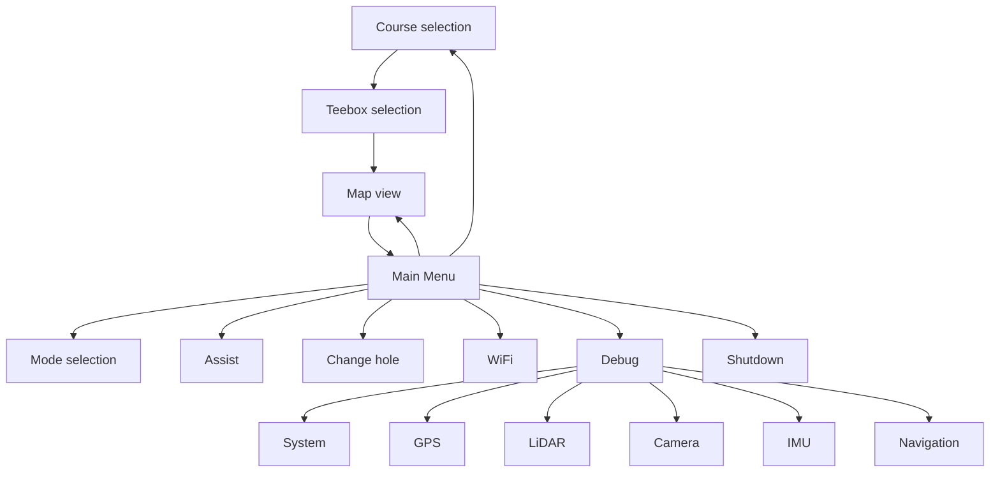

# HMI Specification — Golf Cart Display

> **Status:** Specification
> **Hardware:** 3.5" ILI9488 SPI TFT (480×640 portrait), no touch
> **Input:** Joystick (move / press / long-press / double-press)
> **Node:** `hmi_node` (Python, non-critical)

This document is the authoritative specification for the golf cart's operator
display. It defines the screen layout, navigation model, data sources, and
interaction rules. Mockups are provided as SVGs in [`docs/hmi/`](hmi/).

---

## 1. Design Principles

1. **Safety first.** The HMI is *informational and request-only*. It can never
   bypass the Safety Controller. A fault must never be cleared in a way that
   causes unexpected motor activation.
2. **Glove-friendly.** No touch. All interaction is via the joystick. Targets
   are large, high-contrast, and readable in direct sunlight.
3. **Glanceable.** The operator should read speed, battery, and safety state in
   under a second while driving. Critical info is always on screen.
4. **Consistent.** Every screen shares the same header/footer chrome and
   navigation model.
5. **Modern & clean.** Flat design, generous spacing, a restrained palette, and
   clear typographic hierarchy.

---

## 2. Hardware & Rendering

| Item | Value |
| --- | --- |
| Display | 3.5" ILI9488 SPI TFT |
| Resolution | 480 × 640 px (portrait) |
| Interface | SPI (via `luma.lcd`) |
| Touch | None |
| Refresh | ~10–30 Hz (HMI layer) |
| Language | Python (`hmi_node`) |

**Rendering stack:** `luma.lcd` drives the ILI9488. A small drawing layer
(`hmi_draw.py`) provides primitives (rounded rects, text, icons, progress bars,
polygons) so screens are declarative and easy to maintain.

---

## 3. General Layout

The screen is in **portrait** mode, 480×640 pixels.

```text
+--------------------+
| [TIME]    [STATUS] |
+--------------------+
|                    |
|                    |
|                    |
|                    |
|     [CONTENT]      |
|                    |
|                    |
|                    |
|                    |
|                    |
+--------------------+
```

**Status bar** (always shown):
- `[TIME]` — current time.
- `[STATUS]` — icons representing the state of the system.

**Content** (`[CONTENT]`): a menu or a feature-specific view (hole layout,
sensor debug data, configuration screen).

### Status icons

| Icon | Meaning |
| --- | --- |
| GPS quality | Number of satellites, accuracy |
| Operating mode | Manual/push-assist, follow-me, teleop, autonomous |
| Battery | State of charge |

---

## 4. Input Model

The joystick is the sole HMI input. It has a 4-way tilt (up/down/left/right)
and a push button.

| Gesture | Action |
| --- | --- |
| **MOVE UP/DOWN/RIGHT/LEFT** | Move the joystick in a cardinal direction. Usually highlights or moves an element. When held for more than 1 second, the movement repeats until released. |
| **PRESS** | Press the joystick down. Usually selects or changes an element. |
| **LONG** | Long-press (≥ 3 s) of the joystick button. Usually returns to the main view. |
| **DOUBLE** | Double-press (2 presses within 1.5 s) of the joystick button. Usually returns to the previous screen. |

The `hmi_node` debounces and classifies presses (short/double/long) from the
raw button field in the Arduino serial stream.

---

## 5. Screen Map



- **Course selection** is the first screen shown when the HMI loads.
- **Double press** from any sub-screen returns to the previous screen.
- **Long press** from any sub-screen returns to the **Main Menu**.

---

## 6. Screens

### 6.1 Main Menu

The hub of the HMI. A vertical list of items with a highlighted selection
cursor.

```text
+--------------------+
| Main Menu          |
+--------------------+
| MAP                |
| MODE               |
| ASSIST             |
| CHANGE HOLE        |
| SELECT COURSE      |
| WIFI               |
| DEBUG              |
| SHUTDOWN           |
+--------------------+
```

| Item | Action |
| --- | --- |
| **MAP** | Go to the map view of the current hole. Only selectable when a course and teebox have been selected. |
| **MODE** | Go to the mode selection view. |
| **ASSIST** | Go to the assist configuration view. |
| **CHANGE HOLE** | Go to the hole selection view. Only selectable when a course and teebox have been selected. |
| **SELECT COURSE** | Go to the course selection view. |
| **WIFI** | Show WiFi credentials for the hotspot and a QR code to scan with a phone to connect to the network. |
| **DEBUG** | Go to the debug view. |
| **SHUTDOWN** | Show a confirmation dialog asking whether the user really wants to shut down the system. Shut down if confirmed. |

Mockup: [`docs/hmi/main-menu.svg`](hmi/main-menu.svg)

**Actions**

| Gesture | Action |
| --- | --- |
| MOVE UP/DOWN | Highlight a menu item. |
| PRESS | Select the highlighted item and jump to its view. |
| DOUBLE | Jump to the map view if a course and teebox have been selected. |

---

### 6.2 Course Selection View

The first screen shown when the HMI loads. Lets the user select the course they
are playing on.

```text
+--------------------+
| Courses            |
+--------------------+
|                    |
|                    |
|       [LIST]       |
|                    |
|                    |
|                    |
|                    |
|                    |
+--------------------+
```

`[LIST]`: a list of courses available on the device, plus a **Main Menu** entry.

Mockup: [`docs/hmi/course-selection.svg`](hmi/course-selection.svg)

**Actions**

| Gesture | Action |
| --- | --- |
| MOVE UP/DOWN | Highlight a course (the list may scroll). |
| PRESS | Select the course and jump to the teebox selection screen. Pressing **Main Menu** jumps to the main menu. |
| DOUBLE | Jump to the main menu. |

---

### 6.3 Teebox Selection View

Lets the user select the teebox (color or similar) they are playing from.

```text
+--------------------+
| Teeboxes           |
+--------------------+
|                    |
|                    |
|       [LIST]       |
|                    |
|                    |
|                    |
|                    |
|                    |
+--------------------+
```

`[LIST]`: a list of the teeboxes available at this course, plus a
**Course Selection** entry.

Mockup: [`docs/hmi/teebox-selection.svg`](hmi/teebox-selection.svg)

**Actions**

| Gesture | Action |
| --- | --- |
| MOVE UP/DOWN | Highlight a teebox (the list may scroll). |
| PRESS | Select the teebox and jump to the map view. Pressing **Course Selection** jumps back to the course selection view. |
| DOUBLE | Jump to the main menu. |

---

### 6.4 Map View

Displays a map of the hole the user is currently playing, with additional
information. Also allows selecting a speed when in manual mode.

```text
+--------------------+
|                    |
|                    |
|                    |
|                    |
|        [MAP]       |
|                    |
|                    |
|                    |
+--------------------+
| (-)   Speed   (+)  |
+--------------------+
```

`[MAP]`: a rendered, colorful bird's-eye view of the current hole. The teebox
is at the bottom, the green at the top.

Mockup: [`docs/hmi/map.svg`](hmi/map.svg)

**Speed bar:** lets the user select the speed in manual/push-assist mode. The
bar is hidden when the user is not in manual/push-assist mode.

**Actions**

| Gesture | Action |
| --- | --- |
| MOVE RIGHT/LEFT | Decrease/increase speed for manual/push-assist mode. |
| PRESS | Activate/deactivate push-assist. |
| DOUBLE | Jump to the main menu. |

---

### 6.5 Mode Selection View

Lets the user select one of three operating modes. There is a fourth (hidden)
one: **Teleop**, which is automatically and temporarily activated when
triggered from the WebApp.

```text
+--------------------+
|   Manual/Push Ass. |
| x Follow Me        |
|   Autonomous       |
|                    |
| Main Menu          |
|                    |
|                    |
|                    |
|                    |
|                    |
+--------------------+
```

**Mode list:** the three selectable modes. The currently selected option shows
a checkmark. **Main Menu** returns to the main menu.

Mockup: [`docs/hmi/mode-selection.svg`](hmi/mode-selection.svg)

**Actions**

| Gesture | Action |
| --- | --- |
| MOVE UP/DOWN | Highlight a list item. |
| PRESS | Select the mode, or return to the main menu. |
| DOUBLE | Jump to the main menu. |

---

### 6.6 Assist View

Configures the push-assist / hill-assist behavior.

```text
+--------------------+
| Assist             |
+--------------------+
| Push Assist   [ON] |
| Assist Level  [ 3] |
| Hill Assist   [ON] |
|                    |
| Main Menu          |
|                    |
|                    |
|                    |
|                    |
|                    |
+--------------------+
```

**Content**

| Item | Description |
| --- | --- |
| **Push Assist** | Toggle push-assist on/off. |
| **Assist Level** | Adjust the assist gain (e.g. 1–5). |
| **Hill Assist** | Toggle hill-assist on/off. |
| **Main Menu** | Return to the main menu. |

Mockup: [`docs/hmi/assist.svg`](hmi/assist.svg)

**Actions**

| Gesture | Action |
| --- | --- |
| MOVE UP/DOWN | Highlight a list item. |
| MOVE RIGHT/LEFT | Toggle a switch or adjust a value. |
| PRESS | Select the item / confirm. |
| DOUBLE | Jump to the main menu. |

---

### 6.7 Change Hole View

Lets the user manually select a different hole on the current course.

```text
+--------------------+
| Change Hole        |
+--------------------+
| Hole 1   [380 m]   |
| Hole 2   [350 m]   |
| Hole 3   [410 m]   |
|                    |
| Course Selection   |
|                    |
|                    |
|                    |
|                    |
|                    |
+--------------------+
```

`[LIST]`: a list of the holes on the current course (with the distance for the
selected teebox), plus a **Course Selection** entry.

Mockup: [`docs/hmi/change-hole.svg`](hmi/change-hole.svg)

**Actions**

| Gesture | Action |
| --- | --- |
| MOVE UP/DOWN | Highlight a hole (the list may scroll). |
| PRESS | Select the hole and jump to the map view. Pressing **Course Selection** jumps back to the course selection view. |
| DOUBLE | Jump to the main menu. |

---

### 6.8 WiFi View

Shows the WiFi hotspot credentials and a QR code the user can scan with their
phone to connect to the network.

```text
+--------------------+
| WiFi               |
+--------------------+
| SSID: golfcart-xxxx |
| Pass: 12345678      |
|                    |
|   [ QR CODE ]      |
|                    |
|                    |
|                    |
|                    |
|                    |
+--------------------+
```

**Content**

| Item | Description |
| --- | --- |
| **SSID** | The hotspot network name. |
| **Password** | The hotspot password. |
| **QR code** | A scannable QR code encoding the WiFi credentials (WIFI:S:<ssid>;P:<pass>;;). |

Mockup: [`docs/hmi/wifi.svg`](hmi/wifi.svg)

**Actions**

| Gesture | Action |
| --- | --- |
| PRESS | Refresh / regenerate the QR code. |
| DOUBLE | Jump to the main menu. |

---

### 6.9 Debug View

A sub-menu of diagnostic screens.

```text
+--------------------+
| Debug              |
+--------------------+
| System             |
| GPS                |
| LiDAR              |
| Camera             |
| IMU                |
| Navigation         |
|                    |
| Main Menu          |
|                    |
|                    |
+--------------------+
```

**Actions**

| Gesture | Action |
| --- | --- |
Mockup: [`docs/hmi/debug-menu.svg`](hmi/debug-menu.svg)

| MOVE UP/DOWN | Highlight a debug screen. |
| PRESS | Open the highlighted debug screen. |
| DOUBLE | Jump to the main menu. |

---

### 6.10 System Debug View

Shows overall system health. All read-only diagnostics.

Mockup: [`docs/hmi/system.svg`](hmi/system.svg)

#### Layout

```text
+--------------------+
| System             |
+--------------------+
| Battery   [█████   ] 82% |
| CPU       [█...... ] 35% |
| Disk      [███..... ] 61% |
| Uptime               3:42 |
| Temp                57.2 C |
|                    |
| Main Menu          |
+--------------------+
```

#### Content details

| Field | Source | Format | Notes |
| --- | --- | --- | --- |
| **Battery charge** | `/battery/state` | `NN%` + bar | Color-coded: green ≥ 50%, amber 25–49%, red < 25%. |
| **CPU load** | `/proc/loadavg` | `NN%` | 1-minute load / core count. |
| **Disk space** | `/` filesystem | `NN%` + bar | Root partition usage. |
| **Uptime** | `/proc/uptime` | `H:MM` or `D:HH:MM` | — |
| **Memory usage** | `/proc/meminfo` | `NN%` | Optional; include if space allows. |
| **Main Menu** | — | — | Returns to the main menu. |

**Actions:** MOVE UP/DOWN to scroll (if more rows than fit); MOVE RIGHT/LEFT to
refresh values immediately; DOUBLE to return to the main menu.

---

### 6.11 GPS Debug View

Shows live information from the GPS system.

Mockup: [`docs/hmi/gps.svg`](hmi/gps.svg)

#### Layout

```text
+--------------------+
|  GPS               |
+--------------------+
| Latitude   48.123456 |
| Longitude   11.67890 |
| Elevation      234.1 m |
| Speed            1.2 m/s |
| Heading          47.3 deg |
| Satellites       9    |
| Timestamp  12:34:56 |
| Acc x/y          1.8 m |
| Acc elev         2.4 m |
| Status           FIX  |
|--------------------+|
| Main Menu          | |
+--------------------+|
```

#### Content details

| Field | Source (`/gps/fix`) | Value / formatting |
| --- | --- | --- |
| **Latitude** | `latitude_deg` | 5-6 dp, N/S. |
| **Longitude** | `longitude_deg` | 5-6 dp, E/W. |
| **Altitude** | `altitude_m` | meters, 1 dp. |
| **Speed** | `speed_mps` | m/s, 1 dp. |
| **Heading** | `heading_rad` | degrees 0–360 (converted). |
| **Satellites** | — (if available from the driver) | count. |
| **Timestamp** | `timestamp`/header | HH:MM:SS. |
| **Accuracy x/y** | — (set from a driver or `0.0`) | meters, 1 dp. |
| **Accuracy elev** | — (if available) | meters, 1 dp. |
| **Status** | `valid` | `FIX` (green) / `NO FIX` (red). |

> Note: not every field is currently in `GpsFix` (`speed_mps`, `heading_rad`,
> `valid` are; satellite count + accuracy fields are best-effort from the
> driver). Fields with no source render `—`.

**Actions:** DOUBLE to the main menu; PRESS toggles between compact and verbose
field lists if implemented.

---

### 6.12 LiDAR Debug View

Shows the LiDAR point cloud and obstacle detection overlay.

Mockup: [`docs/hmi/lidar.svg`](hmi/lidar.svg)

#### Layout

```text
+--------------------+
|  LiDAR             |
+--------------------+
|                    |
|      [SCAN]        |   <- top-down bird's-eye point cloud
|                    |
+--------------------+
| Obstacle:  NONE    |   <- stopping-zone state
| Nearest:   1.2 m   |
| Angle:     12.3 deg|
| Main Menu          |
+--------------------+
```

#### Content details

| Field | Source | Details |
| --- | --- | --- |
| **Scan cloud** | `/scan` (`sensor_msgs/LaserScan`) | Points rendered top-down around the trolley. Trolley at center; ~20 m radius. Downsampled to a few hundred points for the 480×640 display. Obstacle points (inside the stopping zone) in red, free points dim. |
| **Obstacle** | `/obstacles/state` (`obstacle_in_zone`) | `NONE` (green) / `OBSTACLE` (red). |
| **Nearest** | `nearest_distance_m` | Closest obstacle distance (m). |
| **Angle** | `nearest_angle_rad` | Bearing to nearest obstacle (deg). |
| **Main Menu** | — | Return to the debug menu. |

**Actions:** PRESS toggles between the top-down cloud and a scrolling raw
range line; DOUBLE to the debug menu.

> The scan is a live LiDAR debug aid, NOT a safety readout; the stopping-zone
> status below is the authoritative safety signal.

---

### 6.13 Camera Debug View

Shows the camera feed and, when available, segmentation.

Mockup: [`docs/hmi/camera.svg`](hmi/camera.svg)

#### Layout

```text
+--------------------+
| Camera             |
+--------------------+
|                    |
|      [CAMERA]      |   <- down-sampled camera frame
|                    |
+--------------------+
| Segmentation: OFF  |
| Seg: [person #1 @ x=240 y=320] |
| Main Menu          |
+--------------------+
```

#### Content details

| Field | Source (`/camera/image` from RealSense D435i) | Details |
| --- | --- | --- |
| **Camera view** | `/camera/image` | Color image downscaled to 480×~320 and rendered. Refreshed at a low rate (~2–5 Hz) to save CPU. |
| **Segmentation** | segmentation node (future) | Overlay mask on the camera view if available. Toggle with MOVE RIGHT/LEFT. |

**Actions:** PRESS toggles the segmentation overlay; MOVE RIGHT/LEFT switches
between color / mono / segmentation feeds; DOUBLE to the main menu.

> The camera is a perception/diagnostic aid only; person detection for
> Follow Me reads `/person/target`, independent of this debug view.

---

### 6.14 IMU Debug View

Shows the IMU attitude and acceleration.

Mockup: [`docs/hmi/imu.svg`](hmi/imu.svg)

#### Layout

```text
+--------------------+
| IMU                |
+--------------------+
| Roll        +0.02  rad |
| Pitch       +0.31  rad |
| Heading     - none -   |
| Accel x     +0.02  m/s2 |
| Accel y     +0.11  m/s2 |
| Accel z     -9.81  m/s2 |
| Temperature   n/a   |
| Status       VALID  |
| Main Menu          |
+--------------------+
```

#### Content details

| Field | Source | Details |
| --- | --- | --- |
| **Roll** | `/imu/data` `roll_rad` | rad, 2 dp, signed with +/-, red if |roll| ≥ limit. |
| **Pitch** | `pitch_rad` | rad, 2 dp. |
| **Yaw** | — (usually derived from a fusion node, not raw IMU) | rad, or `- none -` if unavailable. |
| **Accel x/y/z** | `/imu/data_raw` (sensor_msgs/Imu `linear_acceleration`) | m/s², 2 dp, z near −9.81 at rest. |
| **Temperature** | if the driver provides it | °C. |
| **Status** | `valid` | `VALID` (green) / `STALE` (red). |

> The raw `sensor_msgs/Imu` on `/imu/data_raw` is the source of acceleration;
> the `golfcart_msgs/ImuData` on `/imu/data` provides the derived roll/pitch.

**Actions:** DOUBLE to the main menu; MOVE UP/DOWN to page if a field set is
tall. This view is read-only.

---

### 6.15 Navigation Debug View

Shows the navigation and course-mapping state.

Mockup: [`docs/hmi/navigation.svg`](hmi/navigation.svg)

#### Layout

```
+------------------+
| Navigation       |
+------------------+
|     [COSTMAP]    |   <- course/costmap top-down
| map x, map y     |
|                  |
| Planned: [2,5,1] |
| Path len: 45.2 m |
| Status: NAVIGATING |
| MainMenu         |
+------------------+
```

#### Content

| Field | Source | Details |
| --- | --- | --- |
| **Costmap + features** | `/map`, CourseMap features | Top-down view of the current hole: course boundary, features (greens/tees/water), the slope/obstacle cost layer, and forbidden zones. |
| **Planned route** | `/plan` (`nav_msgs/Path`) | Draw the planned route over the map. |
| **Trolley position** | `/odometry/filtered` | Draw the current map x/y on the costmap. |
| **NavigationStatus** | `/vehicle/estimation` + `/nav2_navigation` | `NavigationStatus` / Nav2 status (IDLE / NAVIGATING / PAUSED / FAILED). |
| **Target pose** | last goal | Show the active goal. |
| **Main Menu** | — | Return to the debug menu. |

**Actions:** MOVE RIGHT/LEFT toggles overlays (costmap / geometry / route);
DOUBLE to the main menu.

---

## 7. Data Sources

The `hmi_node` subscribes to existing topics (read-only) and calls existing
services (request-only).

| Data | Topic / Service |
| --- | --- |
| Speed | `/motor/state` |
| Battery | `/battery/state` |
| Safety state | `/safety/state` |
| Mode | `/mode/state` (or feature status) |
| GPS | `/gps/fix` |
| IMU | `/imu/data` |
| LiDAR / obstacles | `/scan`, `/obstacles/state` |
| Courses | `/course/list` |
| Course map | `/course/map` |
| Hole session | `/course/hole` |
| Course select | `/course/select` (service) |
| Hole select | `/course/hole` (service) |
| Summon | `/summon` (service), `/summon/status` |
| Geofence | `/geofence/status` |
| Feature enable/disable | per-feature services |

---

## 8. Safety Rules

1. The HMI is **request-only**; it never commands motion directly.
2. A fault is shown prominently and is **not auto-cleared**.
3. Clearing a fault requires an explicit operator action and must not cause
   unexpected motor activation.
4. The safety arm switch is handled by the Safety Controller path, not the HMI.
5. If the HMI node crashes, the Safety Controller and motion are unaffected.

---

## 9. Visual Design

### 9.1 Palette

| Token | Hex | Usage |
| --- | --- | --- |
| `bg` | `#0F172A` | Screen background (dark) |
| `surface` | `#1E293B` | Cards / panels |
| `surface-2` | `#334155` | Raised elements |
| `text` | `#F8FAFC` | Primary text |
| `text-dim` | `#94A3B8` | Secondary text |
| `accent` | `#38BDF8` | Selection / focus |
| `ok` | `#34D399` | Good / ready |
| `warn` | `#FBBF24` | Warning |
| `danger` | `#F87171` | Fault / critical |
| `info` | `#818CF8` | Informational |

### 9.2 Typography

- **Speed / headline:** large, bold, tabular numerals.
- **Labels:** small, uppercase, letter-spaced, dim.
- **Body:** medium, high contrast.

### 9.3 Layout

- **Header:** 40 px — mode + safety state + clock.
- **Content:** flexible.
- **Footer:** 32 px — hints (e.g. "● Select   ◉ Back").

---

## 10. Open Items

- Exact assist settings list and value ranges.
- Whether mode selection requires the cart to be stopped.
- Camera segmentation source (RealSense D435i) and rendering.
- LiDAR point-cloud rendering density / downsampling.
