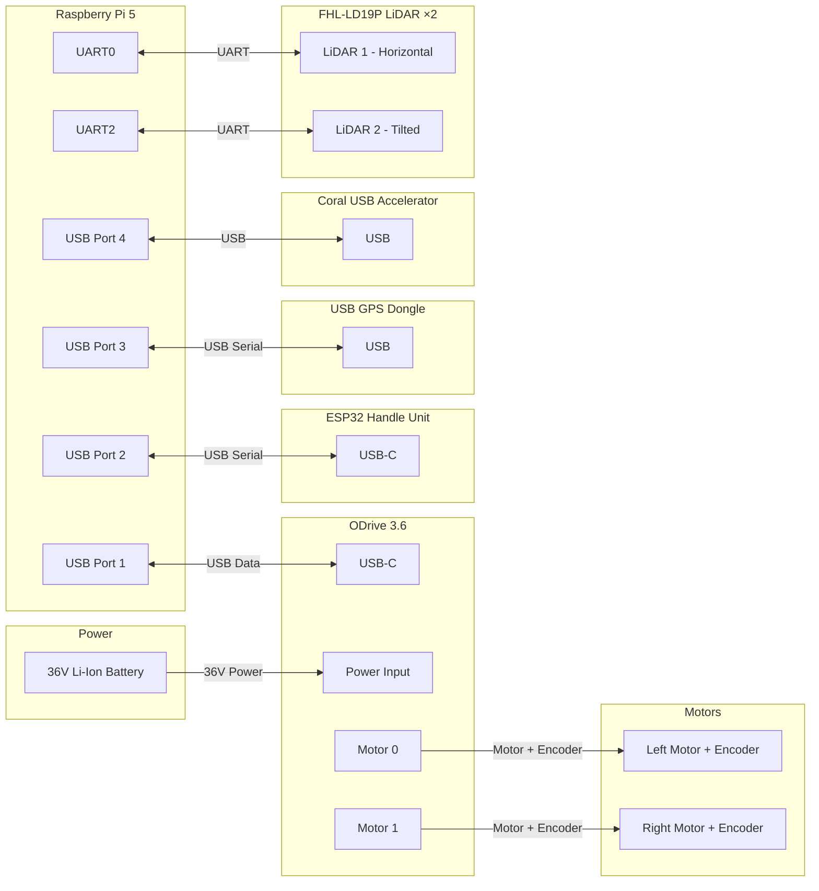
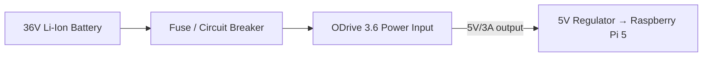

# MVP Wiring Diagrams

This document describes the physical wiring for the joystick-control MVP.

## Scope

The MVP consists of:

- Raspberry Pi 5 (main computer)
- ODrive 3.6 (motor controller)
- Two hoverboard-style DC motors with integrated encoders
- ESP32 handle unit (HMI + joystick + load cell)
- 36 V Li-Ion battery

> **Note:** The ODrive communication interface is **USB** (permanent decision,
> see `architecture.md` §35). The ODrive is powered from the 36 V battery and
> communicates with the RPi 5 over USB. The joystick is read directly by the
> **ESP32 handle unit** (ADC) — **no Arduino** (see `docs/handle-protocol.md`).

---

## 1. System Overview

---

## 2. Power Distribution

**Notes:**
- The ODrive is powered directly from the 36 V battery.
- The RPi 5 is powered from the ODrive's 5 V output (or a separate 5 V regulator).
- A fuse/circuit breaker should be placed between the battery and the ODrive.
- The RPi 5 needs ~5 V / 5 A under load — a separate 5 V/5 A regulator is recommended.
- The ESP32 handle unit is powered via its USB connection to the RPi 5.

---

## 2.1 Power Consumption (one round of golf)

Estimated energy use for a typical 18-hole round (~7 km, ~4 h), using the
range estimator's energy model (`default_wh_per_m = 0.02 Wh/m`).

> **Mass note:** this is an **electric push trolley** — the operator walks and
> pushes, so the operator's mass is carried by their own legs, not the motor.
> The relevant mass for propulsion is the **trolley + bag** (~25–40 kg), not
> the operator. The `0.02 Wh/m` is an **initial guess**; the range estimator
> learns the real value from measured battery current each round.

| Component | Energy |
| --- | --- |
| **Propulsion** (7 km × 0.02 Wh/m, slope-adjusted) | ~100–150 Wh |
| **Electronics** (Pi 5 + ODrive idle + ESP32 + sensors, ~15 W × 4 h) | ~60 Wh |
| **Total** | **~160–210 Wh** |

| | Value |
| --- | --- |
| Battery capacity | 500 Wh usable |
| Usage per round | ~32–42% of the pack |
| Rounds per charge | ~2–3 (comfortably) |

**Caveats:**
- The propulsion estimate assumes a light push trolley (~25–40 kg). A heavier
  trolley or a hilly course pushes it higher; a flat course with good regen
  (see §3.1) can pull it below 100 Wh.
- The Pi 5 is the biggest fixed electronics cost. The energy-saver mode
  (sleeps the Pi when idle) can cut this significantly → ~3 rounds per charge.
- This is an estimate; the range estimator gives the **actual** number once it
  learns the real `Wh/m` from measured battery current.

---

## 3. ODrive 3.6 Connections

| ODrive Terminal | Connects To | Notes |
| --- | --- | --- |
| `VIN` / `GND` | 36 V battery (via fuse) | Main power |
| `M0` (A/B) | Left motor phase wires | Motor 0 = left |
| `M1` (A/B) | Right motor phase wires | Motor 1 = right |
| Encoder 0 | Left motor encoder | |
| Encoder 1 | Right motor encoder | |
| `USB-C` | RPi 5 USB port | Communication |

**Motor/encoder mapping:**
- **Motor 0 (axis0) = left wheel**
- **Motor 1 (axis1) = right wheel**

> This mapping must match the software assumption in
> `odrive_motor_controller.cpp` (axis0 = left, axis1 = right). Verify against
> the physical trolley before commanding motion.

---

## 3.1 Regenerative Braking & Braking Resistor

The ODrive does **regenerative braking by default** in the velocity-control
mode used by `odrive_motor_controller.cpp` (`requested_state: 8` =
`CLOSED_LOOP_CONTROL`). When the commanded velocity is lower than the current
velocity (e.g. a stop), the ODrive applies negative torque, and the motor acts
as a generator feeding energy back to the DC bus.

**The critical caveat:** regen only works if the battery can absorb the
returned current. If the battery is **full** (or the BMS blocks charging), the
DC bus voltage spikes and the ODrive can **fault (overvoltage)** — losing
braking. To prevent this, a **braking resistor** dumps the excess energy as
heat.

### Braking resistor sizing (ballpark)

| Parameter | Value |
| --- | --- |
| **Resistance** | ~10–15 Ω |
| **Power rating** | ≥ 150 W (continuous) |
| **Voltage rating** | ≥ 60 V (margin over the 42 V full charge) |

Derivation (assumes ~150 kg cart + operator, 1.0 m/s max speed):

- Peak regen power ≈ 2 × kinetic energy / stop time ≈ **~150 W**.
- Resistance: `R = V² / P = 44² / 150 ≈ 13 Ω`.

**Verify the mass** — the number scales with cart+operator weight. Lighter
(~100 kg) → ~10 Ω / 100 W; heavier → scale up.

### ODrive wiring

The ODrive 3.6 has a dedicated braking-resistor interface (`BRN`/`BRP`
terminals). Wire the resistor there (not inline with the battery) and configure
`brake_resistance` and `dc_bus_overvoltage_trip_level` (set just above the
full-charge voltage, e.g. ~44–45 V for a 42 V pack).

> **Status:** regen is automatic in the current driver; the braking resistor
> and overvoltage configuration are **hardware-phase** items to validate.

---

## 4. ESP32 Handle Unit + USB GPS Dongle

The **ESP32 handle unit** reads the joystick (ADC), touch, and load cell
directly, and talks to the Pi over a single USB serial link (see
`docs/handle-protocol.md`). **No Arduino** — the ESP32 replaces the Pi-side
joystick interface.

The **GPS** is a **USB dongle** (NMEA over USB serial), which keeps the Pi's
UARTs free for the **two LiDARs** (see `docs/pi-hat-pcb.md`).

| Device | Connects To | Notes |
| --- | --- | --- |
| ESP32 handle unit | RPi 5 USB port (USB-C) | HMI + joystick + load cell, serial |
| USB GPS dongle | RPi 5 USB port | NMEA GPS, serial |
| Coral USB Accelerator | RPi 5 USB port | NPU for vision models (detection/segmentation) |
| Pi Camera Module 3 | RPi 5 CSI port | RGB vision (no USB) |

---

## 4.1 LiDAR (FHL-LD19P ×2)

The trolley uses **two FHL-LD19P 2D LiDARs** (see `docs/features/camera-vision.md`):

- **LiDAR 1 (horizontal)** — follow-me leg detection / obstacle stopping zone.
- **LiDAR 2 (tilted ~25° down)** — ground-plane break detection (ditches/streams).

The Raspberry Pi 5 exposes **multiple UARTs** on the GPIO header (unlike the
Pi 4's single usable UART). Each LiDAR connects to its own UART:

| LiDAR | UART | GPIO (TXD/RXD) | Purpose |
| --- | --- | --- | --- |
| LiDAR 1 (horizontal) | UART0 | GPIO 14 / GPIO 15 | Follow-me legs + obstacle zone |
| LiDAR 2 (tilted) | UART2 | GPIO 0 / GPIO 1 | Ditches / streams (ground-plane breaks) |

> **Why two UARTs:** the Pi 5 has 6 UARTs (UART0–UART5) on the GPIO header, so
> both LiDARs connect directly via UART — **no USB adapter needed** (USB ports
> are full: ODrive, ESP32, GPS, Coral). The HAT routes both UARTs to the two
> LiDAR connectors (see `docs/pi-hat-pcb.md`).

---

## 5. Raspberry Pi 5 Connections

| RPi 5 Port | Connects To | Notes |
| --- | --- | --- |
| USB port | ODrive 3.6 (USB-C) | Motor control |
| USB port | ESP32 handle unit (USB-C) | HMI + joystick + load cell |
| USB port | USB GPS dongle | GPS (NMEA) |
| USB port | Coral USB Accelerator | NPU for vision models (detection/segmentation) |
| CSI | Pi Camera Module 3 | RGB vision (detection/segmentation/gesture) |
| UART0 (GPIO 14/15) | LiDAR 1 (horizontal) | Follow-me legs + obstacle zone |
| UART2 (GPIO 0/1) | LiDAR 2 (tilted) | Ditches / streams |
| I2C (GPIO 2/3) | INA219 battery monitor | Battery voltage/current |
| USB-C power | 5 V regulator (from battery) | Power |

---

## 5.1 Battery Monitor (INA219)

The INA219 measures battery voltage and current over I2C.

> **Voltage divider required:** The INA219 has a **max bus voltage of 26 V**,
> but the 36 V battery reaches ~42 V when fully charged. A **voltage divider**
> (e.g. R1 = R2 = 100 kΩ, divide by 2)must be placed on the VBUS sense pin to
> keep it ≤ 26 V. The measured voltage is then **scaled by the divider ratio**
> (×2)in `battery_node`. The current measurement (via the shunt)is unaffected.

| INA219 Pin | Connects To | Notes |
| --- | --- | --- |
| `VIN+` / `VIN-` | In series with battery + lead | Current sense |
| `VIN-` | ODrive power input | |
| `VBUS` | Battery + via voltage divider (R1/R2) | Bus voltage sense (≤ 26 V) |
| `SDA` | RPi 5 GPIO 2 (I2C SDA) | |
| `SCL` | RPi 5 GPIO 3 (I2C SCL) | |
| `VCC` | 3.3 V | |
| `GND` | GND | |

The `battery_node` publishes `BatteryState` on `/battery/state`. The Safety
Controller stops motion if the battery is critical.

## 6. Safety Notes

- **Fuse:** Always place a fuse/circuit breaker between the battery and ODrive.
- **Power sequencing:** Power the ODrive before or simultaneously with the RPi.
- **Motor wiring:** Verify motor phase and encoder wiring against the ODrive
  documentation before first power-on.
- **Sign convention:** Validate the differential-drive sign convention
  (forward/left/right) against the physical trolley before enabling motion.
- **Safety switch behavior:** The safety arm switch is active-low (internal
  pull-up). Verify the arm/disarm behavior matches the physical switch before
  enabling motion.
- **Emergency stop:** A physical emergency-stop (E-stop) is recommended but is
  **not part of the MVP** (see `architecture.md` §34 open decisions).

---

## 7. Bill of Materials (MVP)

| Component | Qty | Notes |
| --- | --- | --- |
| Raspberry Pi 5 | 1 | Main computer |
| ODrive 3.6 | 1 | Motor controller |
| Hoverboard motor + encoder | 2 | Left/right |
| ESP32 handle unit | 1 | HMI + joystick + load cell (replaces Arduino) |
| USB GPS dongle | 1 | GPS (NMEA) |
| 36 V Li-Ion battery | 1 | Main power |
| INA219 battery monitor | 1 | Battery voltage/current |
| 5 V regulator (5 A) | 1 | Powers RPi 5 |
| Fuse / circuit breaker | 1 | Battery → ODrive |