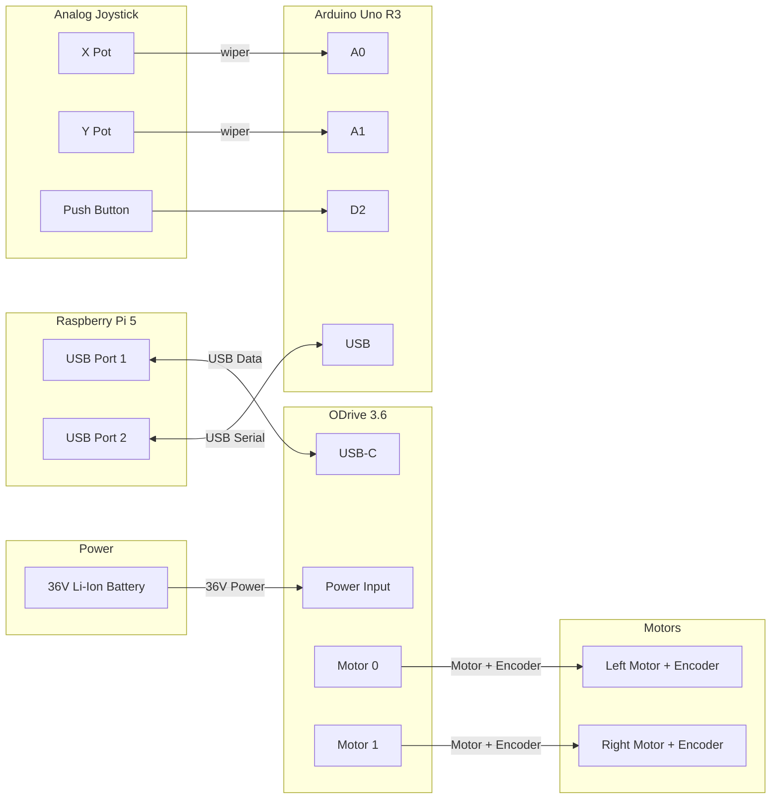
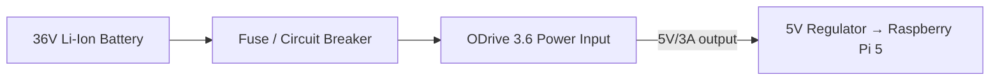

# MVP Wiring Diagrams

This document describes the physical wiring for the joystick-control MVP.

## Scope

The MVP consists of:

- Raspberry Pi 5 (main computer)
- ODrive 3.6 (motor controller)
- Two hoverboard-style DC motors with integrated encoders
- Arduino Uno R3 (joystick interface)
- Analog 2-axis joystick with push button
- 36 V Li-Ion battery

> **Note:** The ODrive communication interface is **USB** (permanent decision,
> see `architecture.md` §35). The ODrive is powered from the 36 V battery and
> communicates with the RPi 5 over USB. The joystick is read by an Arduino Uno
> over USB serial.

---

## 1. System Overview



---

## 2. Power Distribution



**Notes:**
- The ODrive is powered directly from the 36 V battery.
- The RPi 5 is powered from the ODrive's 5 V output (or a separate 5 V regulator).
- A fuse/circuit breaker should be placed between the battery and the ODrive.
- The RPi 5 needs ~5 V / 5 A under load — a separate 5 V/5 A regulator is recommended.
- The Arduino Uno is powered via its USB connection to the RPi 5.

---

## 3. ODrive 3.6 Connections

| ODrive Terminal | Connects To | Notes |
| --- | --- | --- |
| `VIN` / `GND` | 36 V battery (via fuse) | Main power |
| `M0` (A/B) | Left motor phase wires | Motor 0 = left |
| `M1` (A/B) | Right motor phase wires | Motor 1 = right |
| Encoder 0 | Left motor encoder | |
| Encoder 1 | Right motor encoder | |
| `USB-C` | RPi 5 USB port | Communication |

**Motor/encoder mapping:**
- **Motor 0 (axis0) = left wheel**
- **Motor 1 (axis1) = right wheel**

> This mapping must match the software assumption in
> `odrive_motor_controller.cpp` (axis0 = left, axis1 = right). Verify against
> the physical trolley before commanding motion.

---

## 4. Arduino Uno Joystick Interface

The Arduino reads the analog joystick axes and the push button, and sends the
values over USB serial to the RPi 5.

| Arduino Pin | Connects To | Notes |
| --- | --- | --- |
| `A0` | Joystick X wiper | Analog X axis |
| `A1` | Joystick Y wiper | Analog Y axis |
| `D2` | Push button (other side to GND) | Uses internal pull-up |
| `USB` | RPi 5 USB port | Serial communication |

**Joystick potentiometer wiring (each axis):**
- One end → 3.3 V (or 5 V)
- Other end → GND
- Wiper → Arduino analog pin

**Button wiring:**
- One side → Arduino `D2`
- Other side → GND
- Uses the Arduino's internal pull-up (active-low)

**Serial protocol** (from `arduino/joystick_interface/joystick_interface.ino`):
```
x:<0-1023>,y:<0-1023>,btn:<0|1>
```

**Button → safety mapping** (in `arduino_joystick_node.py`):
- Button press → `safety/enable`
- Button release → `safety/stop`

---

## 5. Raspberry Pi 5 Connections

| RPi 5 Port | Connects To | Notes |
| --- | --- | --- |
| USB port | ODrive 3.6 (USB-C) | Motor control |
| USB port | Arduino Uno (USB) | Joystick input |
| I2C (GPIO 2/3) | INA219 battery monitor | Battery voltage/current |
| USB-C power | 5 V regulator (from battery) | Power |

---

## 5.1 Battery Monitor (INA219)

The INA219 measures battery voltage and current over I2C.

| INA219 Pin | Connects To | Notes |
| --- | --- | --- |
| `VIN+` / `VIN-` | In series with battery + lead | Current sense |
| `VIN-` | ODrive power input | |
| `SDA` | RPi 5 GPIO 2 (I2C SDA) | |
| `SCL` | RPi 5 GPIO 3 (I2C SCL) | |
| `VCC` | 3.3 V | |
| `GND` | GND | |

The `battery_node` publishes `BatteryState` on `/battery/state`. The Safety
Controller stops motion if the battery is critical.

## 6. Safety Notes

- **Fuse:** Always place a fuse/circuit breaker between the battery and ODrive.
- **Power sequencing:** Power the ODrive before or simultaneously with the RPi.
- **Motor wiring:** Verify motor phase and encoder wiring against the ODrive
  documentation before first power-on.
- **Sign convention:** Validate the differential-drive sign convention
  (forward/left/right) against the physical trolley before enabling motion.
- **Button behavior:** The button is active-low (internal pull-up). Verify the
  enable/stop behavior matches the physical button before enabling motion.
- **Emergency stop:** A physical emergency-stop (E-stop) is recommended but is
  **not part of the MVP** (see `architecture.md` §34 open decisions).

---

## 7. Bill of Materials (MVP)

| Component | Qty | Notes |
| --- | --- | --- |
| Raspberry Pi 5 | 1 | Main computer |
| ODrive 3.6 | 1 | Motor controller |
| Hoverboard motor + encoder | 2 | Left/right |
| Arduino Uno R3 | 1 | Joystick interface |
| Analog 2-axis joystick + button | 1 | Input |
| 36 V Li-Ion battery | 1 | Main power |
| INA219 battery monitor | 1 | Battery voltage/current |
| 5 V regulator (5 A) | 1 | Powers RPi 5 |
| Fuse / circuit breaker | 1 | Battery → ODrive |